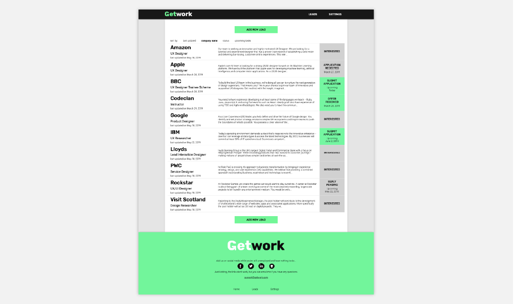
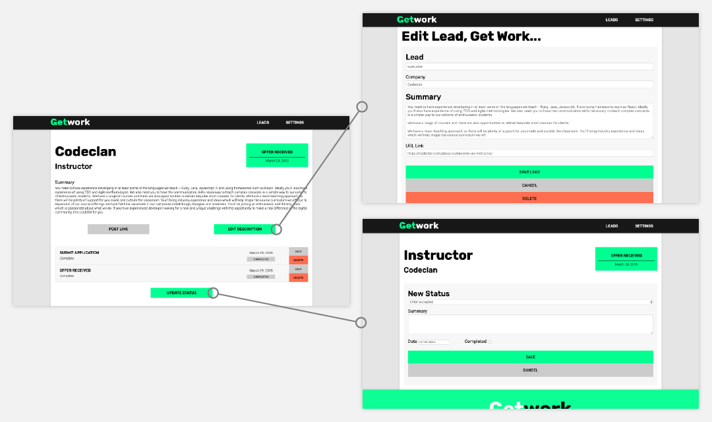

# CodeClan Week 5 Individual Project Project

## Getwork Ruby Application

Getwork was designed to help fellow Codeclan students manage their job search post-graduation by keeping track of leads and documenting their application process.





I am continuing to update and improve this app as I test it in my current job search.

## Running the website locally:


Set Up DB:

```
createdb getwork
```

Seed Database:

```
psql -d getwork -f db/getwork.sql
```

Run App:

```
ruby app.rb
```

### Using

The application is running on port 4567 so visit http://localhost:4567.
